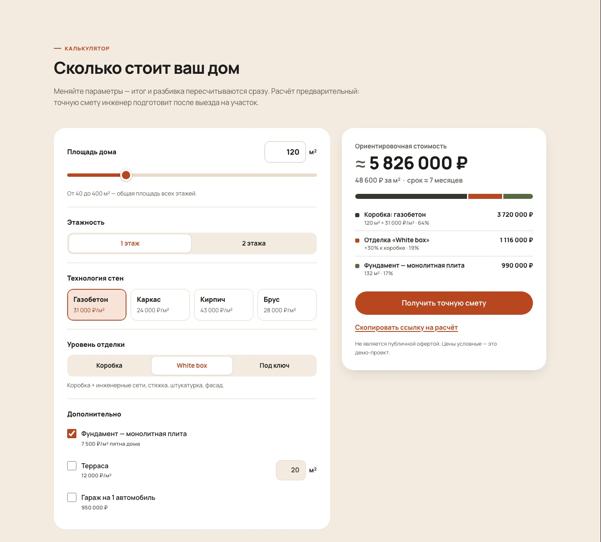
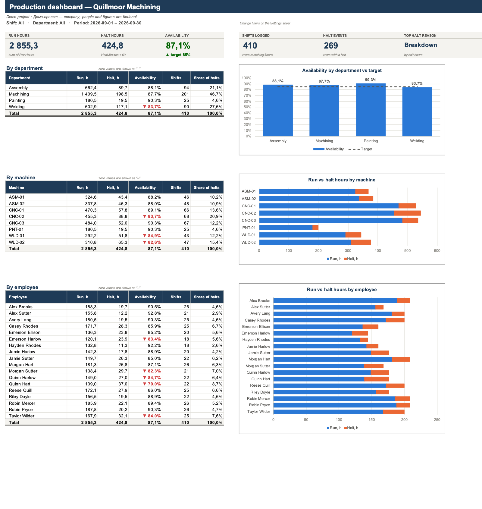

# portfolio

[Русский](README.md) · **English**

This repo has four demo projects (380 tests between them) and a one-page portfolio, [`index.html`](index.html), which GitHub Pages serves at https://sinnercode228.github.io/portfolio/.

Bigger projects live in their own repositories, and each one has a live demo: [flowdesk-crm](https://github.com/sinnercode228/flowdesk-crm), [docmind-rag](https://github.com/sinnercode228/docmind-rag), [tg-shop-miniapp](https://github.com/sinnercode228/tg-shop-miniapp), [integration-hub](https://github.com/sinnercode228/integration-hub), [pulse-analytics](https://github.com/sinnercode228/pulse-analytics). Everything else is on my profile: [github.com/sinnercode228](https://github.com/sinnercode228).

## Four demos

The companies and numbers in the landing page, the bot and the Excel demo are made up.

- [`landing-calculator/`](landing-calculator/) · [live demo](https://sinnercode228.github.io/portfolio/landing-calculator/). A landing page for Polden, a construction company, with a house price calculator. It's HTML/CSS/JS with no build step. Leads from the form go to a [serverless function](landing-calculator/serverless/telegram-lead.mjs) that sends them to Telegram, e-mail, or both at once. 49 tests using `node:test`.
- [`scraper-demo/`](scraper-demo/). An async scraper for books.toscrape.com, a practice site, built with httpx and selectolax: a requests-per-second limit, retries with exponential backoff, an on-disk cache. It exports to XLSX, CSV, JSON and, optionally, Google Sheets. The 80 tests run offline; parsing and crawling are tested against pages saved as fixtures.
- [`telegram-bot-demo/`](telegram-bot-demo/). A lead-capture bot on aiogram 3 and SQLite: a four-step form, a lead card with status buttons for admins, CSV export and broadcasts. 139 tests, including user and admin dialogs that run through the real handlers with a fake Telegram session from [`tests/fakes.py`](telegram-bot-demo/tests/fakes.py).
- [`excel-dashboard-demo/`](excel-dashboard-demo/). Scripts built on openpyxl turn raw CSVs into Excel workbooks where all metrics and totals are calculated with formulas: a production dashboard with filters and a downtime breakdown, and an invoice with payroll and margin. 112 tests; some of them evaluate the formulas in the finished workbooks with pycel and compare the results with a reference implementation in Python.

On every push and pull request, [`.github/workflows/ci.yml`](.github/workflows/ci.yml) runs `npm test` for the landing page, `pytest` in all three Python demos and `ruff check` in the scraper and the bot. In the same workflow, [`check_workbook.py`](excel-dashboard-demo/check_workbook.py) checks the four Excel workbooks committed to `excel-dashboard-demo/output/`.

<p>
  
  
</p>

## Clone and run

Run each project's commands from the repository root. Environment variables and other ways to run each project are covered in its folder's own `README.en.md`.

```bash
git clone https://github.com/sinnercode228/portfolio.git && cd portfolio

# landing-calculator: Node.js 22+, no dependencies
cd landing-calculator && npm test
npm start      # http://localhost:8080, or just open index.html

# scraper-demo: Python 3.10+
cd scraper-demo && python3 -m venv .venv && source .venv/bin/activate
pip install -r requirements-dev.txt && python -m pytest
python -m bookscraper --limit 100 --out output/books   # scrapes over the network

# telegram-bot-demo: Python 3.11+
cd telegram-bot-demo && python3 -m venv .venv && source .venv/bin/activate
pip install -r requirements-dev.txt && python -m pytest
python scripts/demo_dialog.py   # a conversation with the bot in the terminal, no token or network

# excel-dashboard-demo: Python 3.10+. setup creates the venv; all generates the CSVs,
# builds four workbooks in output/, checks the formulas and runs the tests
cd excel-dashboard-demo && make setup all
```

On Windows, the venv is activated with `.venv\Scripts\activate`; the Makefile in excel-dashboard-demo assumes Unix (`.venv/bin/python`).

## The `index.html` page

Styles and scripts live in the file itself, and nothing loads from other domains. From the repo it pulls the cover images in [`assets/projects/`](assets/projects/) and the Unbounded, Onest and JetBrains Mono fonts in [`assets/fonts/`](assets/fonts/) (OFL license, Cyrillic and Latin subsets only, about 150 KB). Both languages are in the markup and CSS hides the unused one, so without JS you see the Russian version. A script in `<head>` sets the language (`?lang=en` or the saved one) and the theme (saved or system) before the first paint. The RU/EN and theme buttons remember your choice, and switching to EN adds `?lang=en` to the URL.

---

Built by Грешный Котик (sinnercode). I take freelance work like this: Telegram [@sinnercode](https://t.me/sinnercode).
