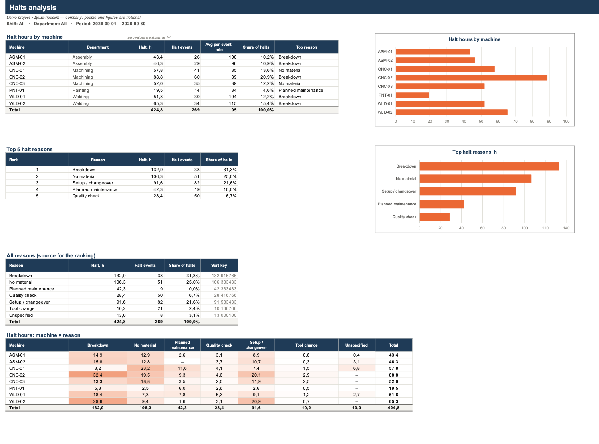

# excel-dashboard-demo

[Русский](README.md) · **English**


Python 3.10+ scripts using openpyxl build two kinds of .xlsx from raw CSV exports: a dashboard from a production log, and an invoice with payroll from a time log. Every total is an Excel formula on top of tables with the source data, so you don't need Python once the workbook is built: change a filter and Excel recalculates the totals and charts on its own. The logs of the fictional Quillmoor Machining and Brindlecote Digital are generated by [`generate_sample_data.py`](generate_sample_data.py).

Prebuilt workbooks: [dashboard](output/dashboard_sample.xlsx) and [invoice](output/invoice_sample.xlsx); the Russian versions are [`dashboard_sample_ru.xlsx`](output/dashboard_sample_ru.xlsx) and [`invoice_sample_ru.xlsx`](output/invoice_sample_ru.xlsx). They're made for Excel 2013 and later and get by without macros, XLOOKUP, FILTER or dynamic arrays.

## A formula linter and three patches for pycel

openpyxl writes formulas as text and computes nothing, and there are 756 formulas in the dashboard and 2,188 in the invoice workbook, in both language versions. I put the checks that run without Excel into [`xldash/formula_check.py`](xldash/formula_check.py), and [`check_workbook.py`](check_workbook.py) runs them.

First, the workbook goes through the linter. Every function in the formulas has to be on an allowlist of 45 Excel 2007–2013 functions, and for the 34 functions on the blocklist (XLOOKUP, FILTER, LET, LAMBDA and so on) it says outright that Excel 2013 doesn't have them. It also checks parentheses, quotes, and that the sheets, tables, columns and names exist.

Then pycel evaluates the formulas. It doesn't understand Excel tables or names, so in a temporary copy of the workbook `tblData[RunHours]` and `critShift` are replaced with A1 ranges like `'Data'!$F$2:$F$411`. In that copy, the tests override input cells and "pick" a shift, department or period. I plug three holes in pycel 1.0b30 with in-memory patches:

- pycel builds `ast.Str` nodes, and Python 3.14 removed that class. I swap in `ast.Constant`.
- pycel's `WEEKDAY()` only takes a date, so `WEEKDAY(x, 2)`, which the weekly summary needs, fails with a `TypeError`. I replace it with my own function for `return_type` 1, 2 and 3.
- `MATCH()` and `INDEX()` over a one-cell range get a scalar and crash (this happens when the log has only one halt reason). A wrapper turns the scalar into a 1×1 range.

The tests check pycel's results against a Python reference ([`production.py`](xldash/production.py), [`worklog.py`](xldash/worklog.py)). If LibreOffice is installed, `check_workbook.py` also recalculates the workbook with it; if it isn't, or the conversion didn't produce a file, that step is skipped.

## Filters on the Settings sheet

The sheet has five yellow input cells: `selShift`, `selDept`, `selFrom`, `selTo` and `tgtAvail`. The first four are dropdowns built with data validation. The dashboard totals are SUMIFS and COUNTIFS formulas that all end with the same criteria (this is the row for machine CNC-01):

```
=SUMIFS(tblData[RunHours],tblData[Machine],$B30,tblData[Shift],critShift,tblData[Department],critDept,
        tblData[Date],">="&dFrom,tblData[Date],"<="&dTo)
```

The criteria are computed on the hidden Lists sheet. When "All" is selected or the cell is empty, `critShift` and `critDept` equal `"*"`, which SUMIFS matches against any non-empty text (the loader replaces empty shifts and departments with "Unspecified" in advance). An empty date turns into the `MIN` or `MAX` of the date column.

Excel pulls a row added right below `tblData` into the table and into the totals. A new machine won't show up that way, because the per-machine rows are created at build time.

## Top 5 halt reasons



Excel 2013 has no SORT, so the ranking is built from `LARGE` and `INDEX/MATCH`. To keep `MATCH` from finding the same reason twice when hours are tied, I rank by the key `hours + (10000 − ROW()) / 1e8` (the "Sort key" column).

## The cross-check cell in the invoice

In the second workbook ([`xldash/invoice.py`](xldash/invoice.py)), every log entry is rounded up to the billing increment, 0.25 h by default: `IF(billInc>0, ROUNDUP(Hours/billInc,0)*billInc, Hours)`. Each specialist's invoice line rounds their total hours times their rate, the per-project table adds up entry amounts that are already rounded, and the cross-check cell shows ✓ if the subtotals differ by less than 0.005. With whole-number rates, as in the sample, they match, but a rate with cents can pull them a few cents apart, and the check will show ✗.

## Messy CSV input

[`xldash/csvio.py`](xldash/csvio.py) reads the CSV, [`xldash/production.py`](xldash/production.py) cleans up the log, and every fix goes to the Import log sheet with its line number.

- Encodings are tried in order (`utf-8-sig`, `cp1251`, `latin-1`), and `csv.Sniffer` picks the delimiter.
- `1,234.5` and `1.234,5` are both read as numbers, and a date with slashes is read as day/month, so a US-style `09/01/2026` (September 1) becomes January 9.
- Spelling variants are reduced to the most frequent one (`cnc-02` → `CNC-02`), exact duplicates are removed, and rows with negative values or with run plus halt time over 24 h are rejected.

## Russian Excel and `TEXT()` format codes

With `--lang ru`, the sheets, headers and table columns are in Russian, so in the Russian workbook the formula above has Cyrillic structured references like `tblData[ЧасыРаботы]`. I build dates as text from `DAY`, `MONTH` and `YEAR`, for example `RIGHT("0"&DAY(d),2)&"."&RIGHT("0"&MONTH(d),2)&"."&YEAR(d)`, because `TEXT()` format codes depend on Excel's language, and in Russian Excel `"yyyy"` is written as `"ГГГГ"` ([`xldash/formulas.py`](xldash/formulas.py)).

## Building the workbooks

From the `excel-dashboard-demo` folder, `make setup all` creates `.venv`, generates the CSVs in `data/`, builds four workbooks in `output/`, and runs `check_workbook.py` and the tests. Without make, one workbook of each kind:

```bash
python3 -m venv .venv && .venv/bin/pip install -r requirements-dev.txt
.venv/bin/python generate_sample_data.py
.venv/bin/python build_dashboard.py data/production_log_sample_ru.csv --lang ru -o output/dashboard_sample_ru.xlsx
.venv/bin/python build_invoice.py data/work_log_sample.csv data/rates_sample.csv -o output/invoice_sample.xlsx
.venv/bin/python check_workbook.py output/dashboard_sample_ru.xlsx output/invoice_sample.xlsx
```

## Tests

`make test` or `.venv/bin/python -m pytest`: 112 tests from 48 functions, thanks to parametrization, and both workbooks are checked in English and in Russian. The workbook tests go through six filter combinations, an empty period, rounding increments of 0 h, 0.5 h and 1 h and a 20% tax, and compare pycel's results with the reference. Edge cases are in [`tests/test_edge_cases.py`](tests/test_edge_cases.py).

---

Built by Грешный Котик (sinnercode). I take freelance work like this: Telegram [@sinnercode](https://t.me/sinnercode).
