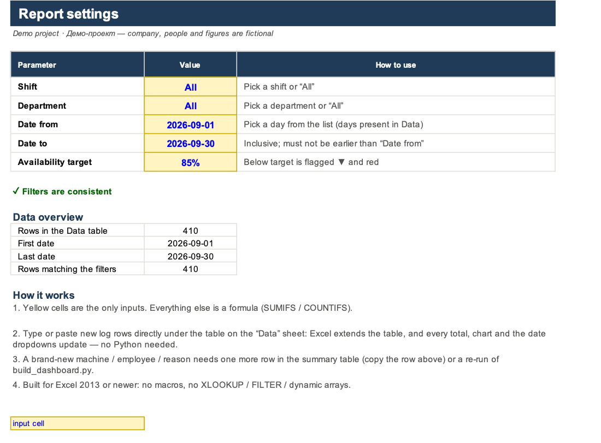
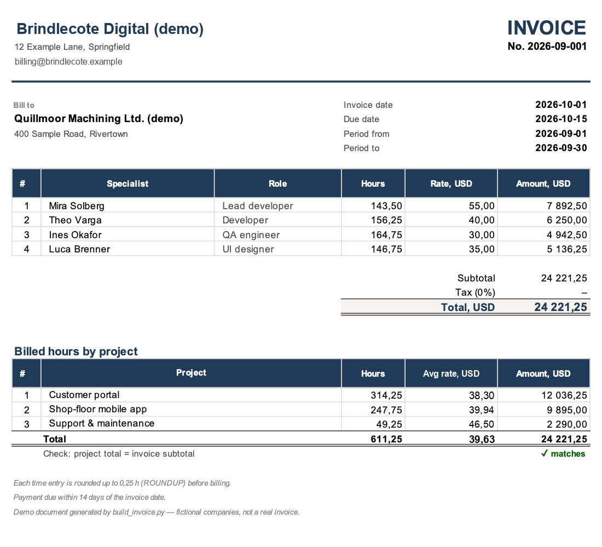
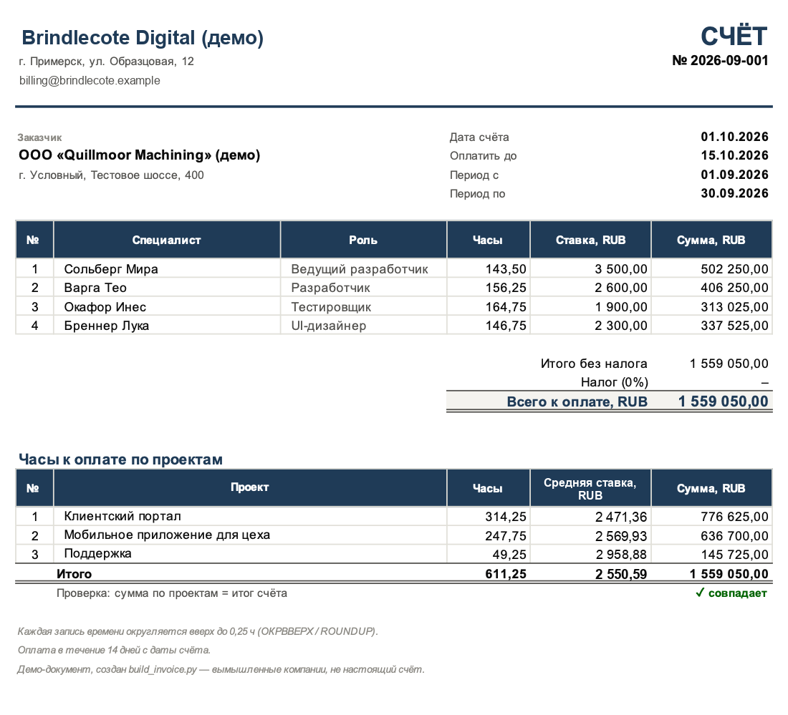
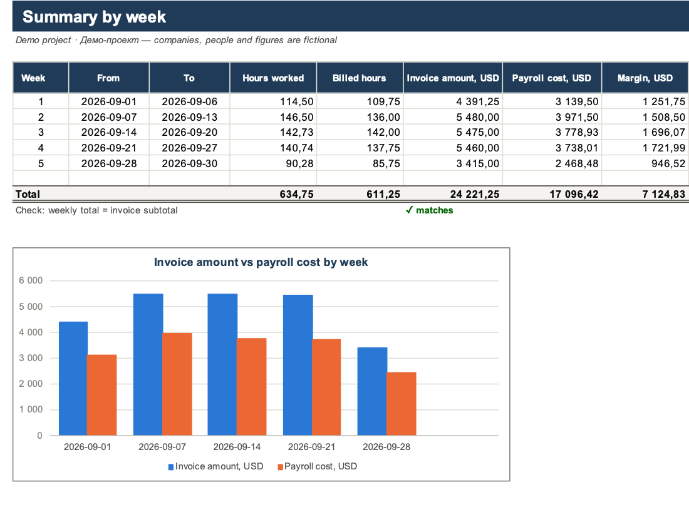
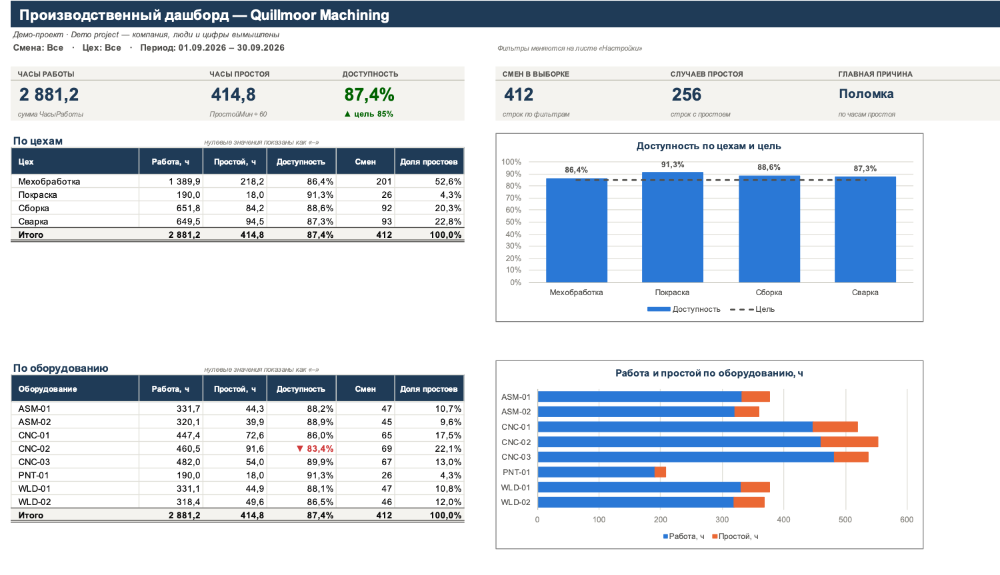

# Excel Dashboard Demo — CSV → живой Excel-дашборд и счёт/зарплата

> **Демо-проект / Demo project.** Компания *Quillmoor Machining*, исполнитель *Brindlecote Digital*,
> все сотрудники и цифры вымышлены и сгенерированы скриптом.
> All companies, people and figures are fictional.

[Русский](#русский) · [English](#english) · [Скриншоты / Screenshots](#скриншоты--screenshots)


---

## Русский

### Что это

Два Python-скрипта, которые превращают «сырые» выгрузки в аккуратные рабочие книги Excel
(библиотека `openpyxl`). Готовая книга **живёт в Excel без Python**: все цифры считаются формулами
и пересчитываются при смене фильтров или добавлении строк.

| Скрипт | Что делает |
|---|---|
| `build_dashboard.py` | Производственный журнал (станки, сотрудники, цеха, смены, часы работы, минуты и причины простоев) → дашборд: KPI, сводки по цехам / оборудованию / сотрудникам, графики, анализ простоев |
| `build_invoice.py` | Журнал рабочего времени + таблица ставок → счёт «время и материалы» (A4, готов к печати), зарплата, маржа, сводка по неделям |
| `generate_sample_data.py` | Генератор тестовых данных (30 дней, EN и RU), в том числе с «грязью» как в реальных выгрузках |
| `check_workbook.py` | Проверка готовых книг без Excel: линтер формул + вычисление каждой формулы через `pycel` |

### Быстрый старт

```bash
cd excel-dashboard-demo
python3 -m venv .venv
.venv/bin/pip install -r requirements-dev.txt     # openpyxl + pytest + pycel

.venv/bin/python generate_sample_data.py          # data/*.csv (EN и RU)
.venv/bin/python build_dashboard.py data/production_log_sample.csv -o output/dashboard.xlsx
.venv/bin/python build_dashboard.py data/production_log_sample_ru.csv --lang ru -o output/dashboard_ru.xlsx
.venv/bin/python build_invoice.py data/work_log_sample.csv data/rates_sample.csv -o output/invoice.xlsx
.venv/bin/python check_workbook.py output/*.xlsx
.venv/bin/python -m pytest
```

На Windows вместо `.venv/bin/python` пишите `.venv\Scripts\python` (и `py -m venv .venv` вместо `python3 -m venv .venv`).

Или одной командой: `make setup all`. Готовые примеры уже лежат в `output/`:
`dashboard_sample.xlsx`, `dashboard_sample_ru.xlsx`, `invoice_sample.xlsx`, `invoice_sample_ru.xlsx`.

Проверено на Python 3.14 (macOS), openpyxl 3.1.5, pycel 1.0b30. Для работы готовых книг нужен только Excel 2013+.

Рядом с каждой формулой в файл записывается уже посчитанное значение (через `pycel`), поэтому
книга правильно выглядит и в просмотрщиках, которые сами не считают: Quick Look, превью в почте,
мессенджере или на телефоне. Excel всё равно пересчитывает книгу при открытии. Отключить:
`--no-preview-values`.

### Дашборд: листы книги

| Лист | Содержимое |
|---|---|
| **Дашборд / Dashboard** | 6 KPI-плиток (часы работы, часы простоя, доступность с отметкой ▲/▼ относительно цели, число смен, число простоев, главная причина); таблицы по цехам, оборудованию и сотрудникам; 3 графика, привязанных к этим таблицам |
| **Простои / Halts** | часы и число простоев по станкам, средний простой, главная причина для каждого станка; **топ-5 причин** (живой рейтинг через `LARGE` + `INDEX/MATCH`); тепловая карта «станок × причина» |
| **Настройки / Settings** | выпадающие списки: смена, цех, дата с / по (список дней строится формулами из данных), целевая доступность; проверка корректности фильтров, сводка по данным |
| **Данные / Data** | очищенный журнал как настоящая **умная таблица Excel** `tblData` |
| **Журнал загрузки / Import log** | сводка «сколько строк принято / что исправлено» и подробный список с номерами строк CSV (с фильтром) |
| Списки / Lists (скрыт) | источники выпадающих списков и итоговые критерии фильтра |

Как устроены фильтры. Каждая цифра — это `СУММЕСЛИМН / СЧЁТЕСЛИМН` по столбцам умной таблицы
с одними и теми же критериями:

```
=SUMIFS(tblData[RunHours], tblData[Machine], $B30,
        tblData[Shift], critShift, tblData[Department], critDept,
        tblData[Date], ">="&dFrom, tblData[Date], "<="&dTo)
```

`critShift` и `critDept` — именованные ячейки: если выбрано «Все», в них стоит `"*"`, и критерий
пропускает любое значение. Пустая дата считается как «с первого / по последний день в данных».
Используются только функции Excel 2007–2013: без `XLOOKUP`, `FILTER`, `UNIQUE`, `LET` и динамических массивов.
Даты превращаются в текст через `ДЕНЬ/МЕСЯЦ/ГОД`, а не через `ТЕКСТ()`, потому что коды формата у `ТЕКСТ()`
зависят от языка Excel.

Если дописать строки прямо под таблицей на листе «Данные», Excel расширит таблицу, и итоги,
графики и список дат обновятся. Это проверено в Excel. Если появится **новый** станок, сотрудник
или причина, для него нужна строка в сводной таблице: скопируйте строку выше или перезапустите скрипт.

### Входные данные и очистка

Колонки: `date, shift, department, machine, employee, run_hours, halt_minutes, halt_reason`.
Принимаются и русские заголовки («Дата», «Смена», «Цех», «Оборудование», «Сотрудник», «Часы работы», «Простой, мин», «Причина простоя») и их варианты.
Загрузчик (`xldash/production.py`):

- определяет кодировку (UTF-8 с BOM или без, Windows-1251) и разделитель (`,`, `;`, табуляция);
- понимает десятичную запятую, `1 234,5`, даты `2026-09-01`, `01.09.2026` и `01/09/2026`;
- приводит написание к одному виду: `day` / `Day ` → `Day`, `cnc-02` → `CNC-02`;
- удаляет точные дубликаты и отклоняет строки с нечитаемой датой или числом, отрицательными
  значениями или больше 24 ч в строке;
- простой без причины помечает как «Не указана»;
- если в выгрузке нет ни одного простоя, лист «Простои» всё равно строится (с нулями).

Каждое действие попадает на лист «Журнал загрузки». Тестовая выгрузка специально содержит такие ошибки.
Тест проверяет, что после очистки «грязный» файл совпадает с чистым.

### Счёт и зарплата: листы книги

| Лист | Содержимое |
|---|---|
| **Счёт / Invoice** | счёт на A4: строка на каждого специалиста (часы × ставка), налог, итог, часы и средняя ставка по проектам, сверка итогов; задана **область печати** и печать в одну страницу |
| **Зарплата / Payroll** | отработанные часы, ставка, начислено, корректировка (ввод), к выплате, выставлено клиенту, маржа, загрузка |
| **Сводка / Summary** | итоги **по календарным неделям** внутри выбранного периода и график «выставлено / фонд оплаты» |
| **Журнал / WorkLog** | умная таблица `tblLog` с вычисляемыми столбцами: `ОКРВВЕРХ(часы / шаг) × шаг`, ставки через `ИНДЕКС/ПОИСКПОЗ`, суммы. Новая строка получает формулы автоматически (проверено в Excel) |
| **Ставки / Rates** | таблица `tblRates`: ставка клиенту и ставка сотруднику (поля ввода) |
| **Настройки / Settings** | номер и дата счёта, период, срок оплаты, шаг округления, налог, валюта, реквизиты сторон |

Каждая запись времени округляется **вверх** до шага оплаты (по умолчанию 0,25 ч = 15 мин;
0 или пустая ячейка — без округления). В счёт попадают только оплачиваемые строки внутри периода.
Имена в журнале сопоставляются со ставками без учёта регистра. Параметры запуска:
`--from 2026-09-01 --to 2026-09-15 --increment 0.5 --tax 0.2 --currency EUR --invoice-no 42`
(даты можно писать и как `01.09.2026`; неверные значения — понятная ошибка, а не трейсбек).

### Как проверялось

- **112 тестов `pytest`**: генератор, парсинг CSV, очистка, структура книг (таблицы, списки, имена,
  графики, область печати). Формулы вычисляются через `pycel` при разных значениях на листе
  настроек (смена, цех, период, пустой период, шаг округления в том числе 0, налог). Результат сверяется
  с расчётом на Python. Отдельно проверены «неудобные» входные данные: выгрузка без простоев,
  одна причина простоя, пустой или битый файл ставок, неверные параметры командной строки.
- **`check_workbook.py`**: линтер (только разрешённые функции Excel 2013, скобки, листы,
  столбцы таблиц, имена) и вычисление всех формул: **756** в дашборде и **2188** в счёте, **0 ошибок**.
  LibreOffice на машине не было, поэтому этот шаг пропускается автоматически.
- **Excel для Mac 16.89**: все четыре книги открыты, пересчитаны и сверены поячеечно с `pycel`.
  Все формулы дашборда совпали; в счёте совпали все, кроме одной: десятичный разделитель
  в текстовой сноске («0,25» в Excel с русской локалью). Там же проверены смена фильтров
  и добавление строк в обе умные таблицы. После финальной ревизии (столбец «Средняя ставка»,
  шаг 0 или пустой шаг, новое имя исполнителя, русский журнал загрузки, сохранённые значения)
  книги снова открыты в Excel: они открываются без ошибок, ключевые ячейки совпадают с `pycel`
  и с расчётом на Python. Скриншоты в `docs/` сделаны из Excel; на двух скриншотах счёта
  изменения финальной ревизии дорисованы по значениям из Excel.

### Структура

```
excel-dashboard-demo/
├── build_dashboard.py        CLI: CSV → дашборд
├── build_invoice.py          CLI: журнал времени + ставки → счёт/зарплата
├── generate_sample_data.py   CLI: тестовые данные
├── check_workbook.py         CLI: проверка формул
├── xldash/
│   ├── sample_data.py        генераторы (детерминированные, seed)
│   ├── csvio.py              кодировки, разделители, числа, даты, заголовки
│   ├── production.py         загрузка/очистка журнала + эталонные расчёты
│   ├── worklog.py            журнал времени, ставки, эталон для счёта
│   ├── dashboard.py          книга-дашборд
│   ├── invoice.py            книга счёт/зарплата
│   ├── formulas.py, style.py помощники: текст формул, оформление, графики
│   └── formula_check.py      линтер + вычисление формул (pycel)
├── tests/                    pytest
├── data/                     пример CSV (EN/RU)
├── output/                   готовые примеры .xlsx
└── docs/                     скриншоты
```

### Ограничения

- Список станков, сотрудников и причин в сводных таблицах задаётся при сборке книги. Строки
  с новыми датами подхватываются автоматически.
- В списке дат не больше 400 дней; для более длинного периода поменяйте `DATE_LIST_LEN`.
- В Google Sheets и LibreOffice книги не проверялись. Целевая программа — Excel 2013+.

---

## English

### What it is

Two Python scripts that turn raw exports into polished Excel workbooks (built with `openpyxl`).
The result **keeps working in Excel without Python**: every number is a formula that recalculates when
the user changes a filter or appends rows.

| Script | What it does |
|---|---|
| `build_dashboard.py` | Production / operations log (machines, employees, departments, shifts, run hours, halt minutes and reasons) → dashboard with KPIs, summaries by department / machine / employee, charts and a halts analysis |
| `build_invoice.py` | Time log + rates table → printable time-and-materials invoice (A4), payroll, margin and a weekly summary |
| `generate_sample_data.py` | Fictional sample data (30 days, EN and RU), optionally with real-world export noise |
| `check_workbook.py` | Checks generated workbooks without Excel: a formula linter plus evaluation of every formula with `pycel` |

### Quick start

```bash
cd excel-dashboard-demo
python3 -m venv .venv
.venv/bin/pip install -r requirements-dev.txt

.venv/bin/python generate_sample_data.py
.venv/bin/python build_dashboard.py data/production_log_sample.csv -o output/dashboard.xlsx
.venv/bin/python build_invoice.py data/work_log_sample.csv data/rates_sample.csv -o output/invoice.xlsx
.venv/bin/python check_workbook.py output/*.xlsx
.venv/bin/python -m pytest
```

On Windows use `.venv\Scripts\python` instead of `.venv/bin/python` (and `py -m venv .venv`).
Or simply run `make setup all`. Ready-made samples are in `output/`. Add `--lang ru` for a fully Russian workbook.

The computed result of every formula is also stored in the file (via `pycel`), so previews that do not
calculate (Quick Look, mail, messenger or phone previews) show real numbers instead of zeros. Excel still
recalculates on open. Use `--no-preview-values` to skip this.
Tested with Python 3.14 (macOS), openpyxl 3.1.5 and pycel 1.0b30. The generated workbooks need only Excel 2013+.

### Dashboard workbook

- **Dashboard**: KPI tiles for run hours, halt hours, availability (▲/▼ against a target), shifts
  logged, halt events and the top reason. It also has tables by department, machine and employee,
  plus bar charts bound to those tables (availability with a target line and stacked run/halt hours).
- **Halts**: halt hours, events, average duration and top reason per machine. A live **top-5 reasons**
  ranking (`LARGE` + `INDEX/MATCH`, ties broken deterministically) and a machine × reason heat map.
- **Settings**: data-validation dropdowns for Shift, Department and Date from / to, plus the
  availability target. The date list is built by formulas from the data, so it grows with new rows.
  The sheet also shows a consistency check and a data overview.
- **Data**: the cleaned log as a real Excel Table (`tblData`).
- **Import log**: a summary (rows accepted, fixes by type) and every fix or rejection with its
  CSV line number, with a filter. A log without any halts still gets a (zero) Halts sheet.
- **Lists** (hidden): dropdown sources and the effective criteria (`critShift`, `critDept`, `dFrom`, `dTo`).

Every figure is `SUMIFS` / `COUNTIFS` over the table's columns with the same criteria. Choosing
“All” becomes the wildcard `"*"`, and a blank date means the first or last day in the data. Only Excel
2007–2013 functions are used: no XLOOKUP, FILTER, UNIQUE, LET or dynamic arrays. Dates are turned into
text with DAY/MONTH/YEAR instead of `TEXT()`, whose format codes change with Excel's UI language.

### Invoice + payroll workbook

- **Invoice**: one line per specialist (hours × rate), then tax and total, hours and average rate
  by project, and a cross-check. The **print area** and page setup are set, so it prints on one A4 page.
- **Payroll**: hours worked, pay, an adjustment input, total pay, billed amount, margin and utilisation.
- **Summary**: a date-range summary by calendar week, with a chart.
- **WorkLog**: Excel Table `tblLog` with calculated columns. Hours are rounded up per entry to the
  billing increment with `ROUNDUP(hours/increment,0)*increment` (0 or blank = no rounding), and rates
  are looked up with INDEX/MATCH (names match regardless of case). New rows get the formulas automatically.
- CLI: `--from/--to/--invoice-date` accept `2026-09-01` or `01.09.2026`; out-of-range `--increment`
  or `--tax` and broken rate files stop with a clear message instead of a traceback.
- **Rates** (input table) and **Settings**: invoice no., dates, period, terms, increment, tax, currency and parties.

### Verification

- **112 pytest tests**. They cover the generator, CSV parsing and cleaning (a messy export must clean
  up to exactly the clean one), and workbook structure. They also evaluate the formulas with `pycel`
  under different Settings values (shift, department, date range, empty range, increment including 0,
  tax) and compare every KPI and table cell with a pure-Python reference. Awkward inputs are covered
  too: a log with no halts, a single halt reason, empty or broken rate files, bad CLI arguments.
- **`check_workbook.py`**: lint plus evaluation of all 756 dashboard and 2,188 invoice formulas,
  **0 error values**. LibreOffice was not installed, so that optional step was skipped.
- **Excel for Mac 16.89**: all four workbooks were opened, recalculated and compared cell by cell
  with pycel. Every dashboard formula matched; in the invoice all but one matched, the difference being
  the locale decimal separator inside a text footnote. Changing filters and appending rows to both
  tables also worked. After the final review (average-rate column, zero or blank increment, renamed
  contractor, Russian import log, stored preview values) the workbooks were reopened in Excel: they
  open cleanly and the key cells match pycel and the Python reference. The screenshots in `docs/`
  come from Excel; in the two invoice screenshots the review changes were drawn in using the Excel values.

### Limitations

- The rows of the summary tables (machines, employees, reasons) are fixed when the workbook is built.
  Appending rows for existing ones updates everything live.
- The date dropdown holds at most 400 days (`DATE_LIST_LEN`).
- Built and verified for Excel 2013+. Google Sheets and LibreOffice were not tested.

---

## Скриншоты / Screenshots

Снимки из Excel для Mac, книги из `output/`. / Screenshots from Excel for Mac, workbooks from `output/`.

**Простои / Halts analysis** — топ-5 причин, тепловая карта «станок × причина»


**Настройки дашборда / Dashboard settings** — выпадающие списки и проверка фильтров



**Счёт / Invoice** (EN и RU)





**Сводка по неделям / Weekly summary**



**Дашборд на русском / Russian dashboard**


