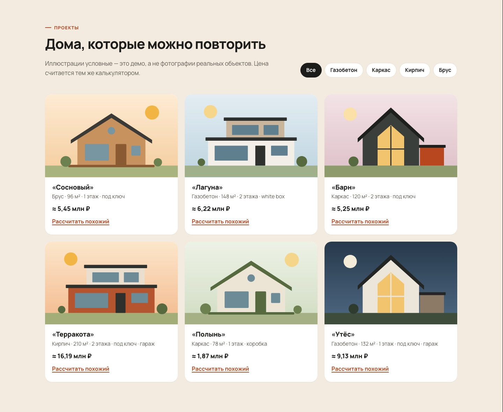

# «Полдень» — лендинг с калькулятором стоимости дома

> **Демо-проект / Demo project.** «Полдень» — вымышленная строительная компания. Цены, адреса, телефоны и объекты условные; иллюстрации нарисованы на SVG/CSS, чужих фотографий нет.

Одностраничный сайт для компании, которая строит частные дома: живой калькулятор стоимости с разбивкой сметы, форма заявки с маской телефона, галерея проектов, этапы работ, гарантии, FAQ и контакты. Чистые HTML, CSS и JS без сборки, поэтому сайт открывается двойным кликом и публикуется на GitHub Pages как есть.

[English version below](#english)




## Что умеет

**Калькулятор**
- Площадь задаётся ползунком или вводом числа, оба поля синхронизированы. Ещё можно выбрать этажность (1 или 2), технологию стен (газобетон, каркас, кирпич, брус), уровень отделки («коробка», white box, «под ключ») и опции: фундамент-плиту, террасу с площадью и гараж.
- Итог пересчитывается сразу. Показаны цена за м², ориентировочный срок, цветная шкала долей и разбивка по статьям. Сумма строк всегда равна итогу, это проверено тестом.
- Цены, коэффициенты и сроки лежат в одном файле `js/config.js`. Варианты технологий и отделки строятся из него же, поэтому новая технология в конфиге сама появится на странице.
- Кнопка «Скопировать ссылку на расчёт» кладёт параметры в URL (`?area=148&floors=2&tech=aerated…`). Если открыть такую ссылку, калькулятор восстановит расчёт.
- Кнопки «Посчитать дом из газобетона» и «Рассчитать похожий» в карточках проектов подставляют параметры в калькулятор. Цены проектов считает тот же калькулятор.
- На телефоне, пока пользователь крутит параметры, снизу держится плашка с итогом.

**Заявка**
- Поля: имя, телефон с маской `+7 (___) ___-__-__` (правка в середине номера и Backspace по скобкам работают корректно) и комментарий.
- Флажок «Приложить расчёт» добавляет в заявку расчёт целиком: параметры, строки сметы и текстовое резюме. Ещё в заявку попадают UTM-метки и адрес страницы.
- Ошибки валидации показываются у полей: `aria-invalid`, `aria-describedby`, фокус переходит на первое поле с ошибкой. Есть honeypot против ботов.
- Бэкенда в демо нет. После отправки показывается экран успеха, а весь payload выводится в консоль браузера (F12). Как подключить Telegram или почту, описано ниже.

**Остальное**
- Разделы: первый экран, технологии, калькулятор, заявка, этапы, проекты с фильтром, гарантии, FAQ-аккордеон на `<details>` (одновременно открыт один ответ), контакты с картой-заглушкой, подвал.
- Для Яндекс.Метрики подготовлены закомментированный счётчик и функция `track()` с целями. Подробнее в разделе про Метрику.
- Вёрстка mobile-first и проверена на ширине 375 px без горизонтальной прокрутки. Шрифт — Manrope (Google Fonts) с системным запасным вариантом.
- Доступность: ссылка «Перейти к содержимому», у всех полей есть подписи, `fieldset`/`legend`, видимый фокус, `aria-live` для итога, `prefers-reduced-motion`, контраст текста не ниже 4.5:1.
- Размер: HTML + CSS + JS весят около 37 КБ в gzip. Зависимостей нет.

## Быстрый старт

Сборка не нужна.

```bash
# вариант 1: просто открыть файл
open index.html

# вариант 2: локальный сервер (нужен, например, для копирования ссылки в буфер)
npm start            # = python3 -m http.server 8080
# → http://localhost:8080
```

## Тесты

Нужен Node.js 20 или новее. Зависимости ставить не нужно, используется встроенный `node:test`.

```bash
npm test
```

44 теста в четырёх файлах:

| Файл | Что проверяет |
|---|---|
| `tests/calc.test.js` | Формулы на конкретных числах; сумма строк равна итогу на переборе 360 комбинаций; монотонность цены; нормализация ввода (границы, строки, `__proto__`); сроки; форматирование ₽; склонения; ссылка с расчётом |
| `tests/form-utils.test.js` | Маску телефона и позицию курсора, Backspace по символам маски, валидацию, UTM, состав payload |
| `tests/serverless.test.mjs` | Пример serverless-функции с подменённым `fetch`: CORS, 405/400/413/422, honeypot, отправку в Telegram и e-mail, экранирование HTML, лимит длины сообщения |
| `tests/page.test.js` | Уникальность id, существование файлов и якорей, наличие в разметке всех id из `app.js`, подписи у полей, корректность JSON в пресетах, демо-пометку, размер страницы |

## Структура

```
landing-calculator/
├── index.html                 # вся страница + SVG-спрайт иконок и иллюстраций
├── css/styles.css             # стили, дизайн-токены в :root
├── js/
│   ├── config.js              # цены, коэффициенты, сроки, leadEndpoint
│   ├── calc.js                # чистые функции расчёта (без DOM)
│   ├── form-utils.js          # маска телефона, валидация, сборка заявки (без DOM)
│   └── app.js                 # связывает всё со страницей
├── serverless/telegram-lead.mjs  # пример приёма заявок → Telegram / e-mail
├── tests/                     # node --test
├── assets/favicon.svg
└── docs/                      # скриншоты для README
```

`config.js`, `calc.js` и `form-utils.js` написаны в формате UMD. В браузере они подключаются обычным `<script>` и работают даже с `file://`, а в Node загружаются через `require()`, поэтому тесты проверяют тот же код, что работает на странице.

## Как устроен расчёт

```
коробка   = площадь × цена_технологии × коэф_этажности   (2 этажа: ×0.94)
отделка   = коробка × (множитель_отделки − 1)             (white box ×1.3, под ключ ×1.65)
плита     = ⌈площадь / этажи × 1.1⌉ м² × 7 500 ₽
терраса   = м² × 12 000 ₽
гараж     = 950 000 ₽
итого     = сумма строк (каждая округлена до 1 000 ₽)
срок, мес = база_технологии + срок_отделки + (площадь − 100)/100 + 0.5 за 2 этажа + 0.5 за гараж → вверх
```

Чтобы поменять цены, достаточно отредактировать `js/config.js`:

```js
technologies: {
  aerated: { label: 'Газобетон', price: 31000, months: 5 },
  // добавьте свою технологию — она появится в калькуляторе автоматически
  sip: { label: 'СИП-панели', price: 22000, months: 2 }
}
```

## Подключение заявок: Telegram и почта

На фронтенде достаточно указать адрес обработчика в `js/config.js`:

```js
leadEndpoint: 'https://polden-lead.<ваш-аккаунт>.workers.dev'
```

Форма отправит `POST` с JSON: `{ name, phone, phoneFormatted, comment, website, calculation, meta }`. Готовый обработчик лежит в [`serverless/telegram-lead.mjs`](serverless/telegram-lead.mjs). Он проверяет данные, отсекает ботов, экранирует HTML и отправляет сообщение в Telegram. Если указать ключ [Resend](https://resend.com), он дополнительно отправит письмо.

### 1. Бот в Telegram
1. Создайте бота у [@BotFather](https://t.me/BotFather) и скопируйте токен.
2. Добавьте бота в рабочий чат или группу и напишите там любое сообщение.
3. Откройте `https://api.telegram.org/bot<ТОКЕН>/getUpdates` и найдите `chat.id` (у групп он отрицательный).

### 2. Cloudflare Workers (бесплатного тарифа хватает)
Файл запускается как есть. Создайте рядом `wrangler.toml`:

```toml
name = "polden-lead"
main = "serverless/telegram-lead.mjs"
compatibility_date = "2026-01-01"

[vars]
ALLOWED_ORIGIN = "https://<username>.github.io"
```

```bash
npx wrangler secret put TELEGRAM_BOT_TOKEN
npx wrangler secret put TELEGRAM_CHAT_ID
npx wrangler deploy
```

### Vercel или Netlify
Обработчик написан на стандартном Web API (`Request → Response`), поэтому хватит тонкой обёртки:

```js
// Vercel: api/lead.js
import { handleLead } from '../serverless/telegram-lead.mjs';
export const POST = (req) => handleLead(req, process.env);
export const OPTIONS = (req) => handleLead(req, process.env);
```

```js
// Netlify: netlify/functions/lead.mjs
import { handleLead } from '../../serverless/telegram-lead.mjs';
export default (req) => handleLead(req, process.env);
export const config = { path: '/api/lead' };
```

### Почта
Задайте переменные `RESEND_API_KEY`, `LEAD_EMAIL_TO` и `LEAD_EMAIL_FROM` (домен отправителя нужно подтвердить в Resend). Если Telegram тоже настроен, заявка уйдёт в оба канала, и ошибка одного из них не помешает второму.

Если сервер не нужен вовсе, можно направить `leadEndpoint` в сервис форм, который пересылает JSON на почту. Ответ с кодом 2xx форма считает успехом.

| Переменная | Обязательна | Назначение |
|---|---|---|
| `TELEGRAM_BOT_TOKEN` | для Telegram | токен от @BotFather |
| `TELEGRAM_CHAT_ID` | для Telegram | id чата или группы |
| `ALLOWED_ORIGIN` | желательно | адрес сайта для CORS (по умолчанию `*`) |
| `RESEND_API_KEY`, `LEAD_EMAIL_TO`, `LEAD_EMAIL_FROM` | для почты | отправка писем через Resend |

## Яндекс.Метрика

1. Создайте счётчик и в `index.html` раскомментируйте блок в `<head>`, подставив номер счётчика.
2. В `js/app.js` задайте `METRIKA_ID` и раскомментируйте вызов `ym(…, 'reachGoal', …)` в функции `track()`.
3. Заведите в Метрике JavaScript-цели:

| Цель | Когда срабатывает |
|---|---|
| `calc_used` | первое изменение калькулятора (один раз за визит) |
| `calc_preset` | нажата кнопка «Посчитать…» или «Рассчитать похожий» |
| `calc_share` | скопирована ссылка на расчёт |
| `calc_cta` | нажата кнопка «Рассчитать стоимость» или «Получить точную смету» |
| `lead_error` | заявка не прошла валидацию |
| `lead_submit` | заявка отправлена |
| `phone_click` | клик по телефону |
| `faq_open` | открыт вопрос в FAQ |

Пока счётчик не подключён, цели пишутся в консоль как `[Метрика · демо] reachGoal …`.

## Публикация на GitHub Pages

1. Загрузите папку в репозиторий.
2. Откройте Settings → Pages → Deploy from a branch → `main` / `(root)`.
3. Файл `.nojekyll` уже лежит в проекте, Jekyll обрабатывать сайт не будет.

На реальном сайте уберите `<meta name="robots" content="noindex, nofollow">` и демо-плашку, а также замените контакты и текст политики конфиденциальности.

---

<a id="english"></a>

# "Polden": a house-building landing page with a cost calculator

> **Demo project.** "Polden" is a fictional house-building company. All prices, addresses, phone numbers and projects are placeholders. The illustrations are hand-made SVG/CSS with no third-party photos.

This is a one-page site for a private house builder. It has a live house cost calculator with an itemised estimate, a lead form with a phone mask, a filterable project gallery, work stages, guarantees, an FAQ and contacts. It uses plain HTML, CSS and JS with no build step, so it works from `file://` and deploys to GitHub Pages as is.

## Features
- **Calculator.** Inputs: area (slider and number input), floors, wall technology (aerated concrete, timber frame, brick, glued timber), finish level (shell, white box, turnkey) and options (slab foundation, terrace area, garage). The result updates live and shows the price per m², an estimated build time, a proportion bar and an itemised breakdown. All prices live in `js/config.js`, and the calculator's options are generated from that file. The current calculation can be shared as a URL. The project cards and technology cards can preload their parameters into the calculator. On mobile, a sticky total bar stays visible while you change inputs.
- **Lead form.** Fields: name, a masked Russian phone number (caret-aware editing) and a comment. There is an option to attach the full calculation. The form also captures UTM tags and has a honeypot field and accessible inline validation. With no backend, the demo shows a success state and logs the JSON payload to the console.
- **Sections.** Hero, technologies, calculator, lead form, stages, projects with a filter, guarantees, an FAQ accordion (native `<details name>`) and contacts.
- **Yandex Metrika.** The counter snippet and the `track()` goal hooks are included as commented-out placeholders.
- **Quality.** The layout is mobile-first and has no horizontal scroll at 375 px. The page has accessible labels and landmarks, visible focus, `aria-live` updates and reduced-motion support. It weighs about 37 KB gzipped and has zero dependencies.

## Run and test
```bash
open index.html        # or: npm start → http://localhost:8080
npm test               # Node ≥ 20, no install needed: 44 tests
```
The tests cover the calculator maths (including a check that the item rows add up to the total across 360 input combinations), input normalisation, formatting, the phone mask and caret logic, validation, the lead payload, the serverless handler (with a mocked `fetch`) and static checks of the page markup.

## Receiving leads (Telegram / e-mail)
Set `leadEndpoint` in `js/config.js`. The form then POSTs its JSON payload to that URL. [`serverless/telegram-lead.mjs`](serverless/telegram-lead.mjs) is a Web-standard handler: it validates the payload, drops bot submissions, escapes HTML, and sends the lead to Telegram and optionally e-mails it via Resend.
- **Cloudflare Workers:** deploy the file as is (see the `wrangler.toml` example above). Set `TELEGRAM_BOT_TOKEN` and `TELEGRAM_CHAT_ID` as secrets and `ALLOWED_ORIGIN` as a variable.
- **Vercel / Netlify:** use the three-line wrappers shown above.
- **E-mail:** set `RESEND_API_KEY`, `LEAD_EMAIL_TO` and `LEAD_EMAIL_FROM`.

## Deploy
Push the folder to a repository and enable GitHub Pages (branch `main`, root folder). For a real client, remove the `noindex` meta tag and the demo banner, and replace the contacts and the privacy policy text.

---

Разработка / Author: [sinnercode228](https://github.com/sinnercode228) · MIT
