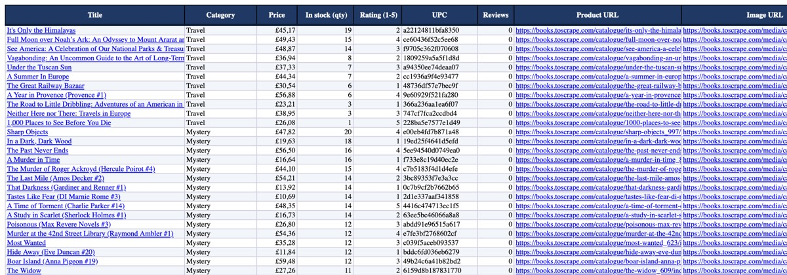

# Books Scraper — асинхронный парсер с выгрузкой в Excel / CSV / JSON

> **Демо-проект / Demo project.** Парсер работает с [books.toscrape.com](https://books.toscrape.com), это учебная песочница, сделанная специально для практики скрапинга. Цены и рейтинги там случайные. Проект показывает, как я пишу парсеры для клиентов, и никак не связан с владельцами сайта.

[Русский](#русский) · [English](#english)



<sub>Превью листа Books в macOS Quick Look. Data bars и цветовую шкалу рейтинга Quick Look не рисует, в Excel они видны.</sub>

---

## Русский

### Что умеет

| | |
|---|---|
| **Обход сайта** | главная → 50 категорий → пагинация → карточки товаров |
| **Поля** | название, цена, остаток (шт.), рейтинг 1–5, UPC, категория, описание, URL картинки, URL товара, число отзывов, время сбора. В JSON дополнительно: валюта, флаг «в наличии», цены без налога и с налогом, налог |
| **Асинхронность** | `httpx` + `asyncio`, лимит одновременных запросов (`--concurrency`) |
| **Вежливость** | лимит запросов в секунду (`--rate`), проверка `robots.txt`, честный User-Agent |
| **Надёжность** | повторы с экспоненциальной задержкой и jitter на 5xx / 429 / сетевые ошибки, учитывает `Retry-After`. Упавшая страница не останавливает весь сбор |
| **Кэш** | ответы сохраняются на диск с TTL. Повторный запуск идёт без обращений к сайту |
| **Чистка данных** | нормализация пробелов, удаление невидимых символов (soft hyphen, zero-width), удаление обрезанного анонса и хвоста «...more» из описаний, пробел между склеенными предложениями («Indonesia.But» → «Indonesia. But») |
| **Экспорт** | **Excel** (оформленная шапка, автофильтр, закреплённые строка и столбец, ширина колонок, кликабельные ссылки, формат £, data bars, цветовая шкала рейтинга, листы Summary и About), **CSV** (UTF-8 с BOM, кодировка в Excel не ломается; `--csv-sep semicolon` даёт «;» и десятичную запятую, и русский Excel сразу раскладывает файл по колонкам), **JSON**. Текст вида `=...` в Excel остаётся текстом, а не формулой |
| **Google Sheets** | по желанию, через `gspread` (см. ниже). Для запуска не нужен |
| **Тесты** | 80 тестов `pytest`, работают без сети: парсеры проверяются на сохранённом HTML, сеть подменяется `httpx.MockTransport` |

### Быстрый старт

Нужен Python 3.10+ (проверено на 3.10 и 3.14). Проверьте `python3 --version`: на macOS системный `python3` бывает 3.9, тогда создайте окружение через более новую версию, например `python3.12 -m venv .venv`.

```bash
cd scraper-demo
python3 -m venv .venv
source .venv/bin/activate            # Windows: .venv\Scripts\activate
pip install -r requirements.txt

python -m bookscraper --limit 100 --out output/books
# → output/books.xlsx, output/books.csv, output/books.json
```

Можно поставить пакетом, тогда появится команда `bookscraper`: `pip install -e .`

### Примеры

```bash
# список категорий
python -m bookscraper --list-categories

# одна категория, только Excel
python -m bookscraper --category Mystery --out output/mystery.xlsx

# несколько категорий (по имени или slug, регистр не важен), 50 книг, CSV + JSON
python -m bookscraper -c "science fiction" -c poetry -n 50 -o output/sf.csv -o output/sf.json

# весь сайт (1000 книг) аккуратно: 3 потока, 2 запроса в секунду
python -m bookscraper --concurrency 3 --rate 2 --out output/all_books

# без кэша, с подробным логом
python -m bookscraper -n 20 --no-cache -v

# CSV для Excel с русской локалью (разделитель «;»)
python -m bookscraper -n 100 -o output/books.csv --csv-sep semicolon
```

Все параметры: `python -m bookscraper --help`.

| Параметр | По умолчанию | Что делает |
|---|---|---|
| `-c, --category` | все | категория, можно указать несколько раз |
| `-n, --limit` | без лимита | максимум книг |
| `-o, --out` | `output/books` | файл `.xlsx` / `.csv` / `.json`. Без расширения (или папка) пишутся все три формата. Можно указать несколько раз |
| `--csv-sep` | `comma` | разделитель CSV: `comma`, `semicolon` (для русского Excel, с десятичной запятой), `tab` |
| `--concurrency` | 5 | одновременных запросов |
| `--rate` | 4 | запросов в секунду (0 = без ограничения) |
| `--retries` | 3 | повторов на ошибку |
| `--cache-ttl` | 24 | время жизни кэша, в часах (0 = бессрочно) |
| `--no-cache` | — | отключить кэш |
| `--gsheet` | — | дополнительно выгрузить в Google Sheets |
| `-v` / `-q` | — | подробный лог / только предупреждения и ошибки |

Коды выхода (удобно для cron и CI): `0` готово, `1` ничего не собрано, `2` неверные параметры или неизвестная категория, `3` сайт недоступен, `4` ошибка Google Sheets, `5` не удалось сохранить файл (например, он открыт в Excel). Если часть страниц не скачалась, сбор продолжается, а в конце выводится список ошибок.

### Реальный прогон (есть в репозитории)

`python -m bookscraper --limit 100 -o output/books_sample.xlsx -o output/books_sample.csv -o output/books_sample.json`

```
categories: 50 selected of 50
  Travel                   11 product links
  Mystery                  32 product links
  Historical Fiction       26 product links
  Sequential Art           31 product links
fetching 100 product pages ...
scraped 100 books in 30.3s — 109 HTTP requests, 0 cache hits, 0 retries, 0 errors
```

Около 30 секунд на 100 книг: это скорость, которую задаёт `--rate 4`, а не предел парсера. Повторный запуск из кэша занимает около 1.4 с. Весь сайт (`--concurrency 3 --rate 2`): 1000 книг из 50 категорий примерно за 9 минут, 0 ошибок.
Результаты: [`output/books_sample.xlsx`](output/books_sample.xlsx), [`output/books_sample.csv`](output/books_sample.csv), [`output/books_sample.json`](output/books_sample.json).

**Что внутри Excel-файла**
- **Books**: по строке на книгу, 11 колонок. Шапка оформлена, строка заголовков и столбец Title закреплены, стоит автофильтр. Название и URL кликабельны. Цены в формате `£`, у остатков data bars, у рейтинга цветовая шкала. Файл настроен на печать в альбомной ориентации по ширине листа.
- **Summary**: сводка по категориям: сколько книг, средняя, минимальная и максимальная цена, остаток, средний рейтинг, строка TOTAL.
- **About**: источник, дата, параметры запуска, пометка «Демо-проект».

### Тесты

```bash
pip install -r requirements-dev.txt
python -m pytest -q        # 80 passed
```

| Файл | Что проверяет |
|---|---|
| `tests/test_parsers.py` | парсеры на реальном HTML из `tests/fixtures/`: категории, пагинация, все поля карточки, граничные случаи (нет в наличии, нет рейтинга и описания, цена `£1,234.50`, невидимые символы, склеенные предложения) |
| `tests/test_fetcher.py` | повторы при 503, сетевые ошибки, отказ после N попыток, 404 без повторов, `Retry-After`, кэш и TTL, сбой записи кэша не ломает сбор, лимит запросов в секунду и лимит одновременных запросов |
| `tests/test_crawler.py` | полный обход «офлайн-копии» сайта: пагинация, `--limit` останавливает обход раньше, дубликаты, временные ошибки, упавшая страница каталога попадает в отчёт об ошибках |
| `tests/test_exporters.py` | в xlsx действительно есть автофильтр, закрепление, ссылки, форматы и сводка, «формулы» остаются текстом. CSV с BOM, кириллицей и разделителем `;`, JSON |
| `tests/test_cli.py` | запуск `main()` целиком: все форматы, кэш при повторном запуске, неизвестная категория, ошибка сохранения файла |
| `tests/test_gsheets.py` | выгрузка в Google Sheets на поддельном `gspread`: очистка и расширение листа, понятные ошибки |

### Выгрузка в Google Sheets (необязательно)

1. `pip install -r requirements-gsheets.txt`
2. В Google Cloud Console создайте service account, включите Google Sheets API и Google Drive API, скачайте JSON-ключ в `service_account.json`. Он уже в `.gitignore`.
3. Откройте доступ к таблице для e-mail сервисного аккаунта (права редактора).
4. `python -m bookscraper -n 100 --gsheet <ID или URL таблицы> --gsheet-creds service_account.json`

Данные попадут на лист `Books`. Шапка будет жирной и закреплённой, фильтр включён.

### Структура

```
bookscraper/
  parsers.py        # чистые функции HTML → данные (при смене сайта меняется в основном этот файл)
  fetcher.py        # httpx: семафор, rate limiter, повторы с backoff, кэш
  cache.py          # дисковый кэш с TTL, атомарная запись
  crawler.py        # категории → страницы → карточки, --limit, сбор ошибок
  models.py         # dataclass Book / Category
  exporters/        # excel.py, tabular.py (CSV/JSON), gsheets.py
  cli.py            # argparse CLI
tests/              # pytest + сохранённые HTML-фикстуры
output/             # примеры результатов
docs/               # превью Excel для README
```

### Как я адаптирую это под ваш сайт

1. **Разбор сайта (от 30 минут).** Смотрю структуру: каталог, пагинация, карточка. Проверяю, есть ли скрытый JSON API: он быстрее и надёжнее HTML. Смотрю, нужен ли браузер (Playwright) для JS-страниц. Читаю `robots.txt` и условия использования.
2. **Поля.** Согласуем список колонок и формат: Excel, CSV, Google Sheets, база данных или API.
3. **Парсеры.** Переписываю `parsers.py` под ваши селекторы, сохраняю HTML-фикстуры и пишу на них тесты. Если сайт поменяет вёрстку, тест сразу покажет, что сломалось.
4. **Масштаб и защита.** Подбираю `--concurrency` и `--rate` так, чтобы не нагружать сайт. При необходимости добавляю прокси, авторизацию, cookies, заголовки.
5. **Запуск по расписанию.** cron, GitHub Actions или сервер. Отчёт отправляю в Telegram или на почту, сохраняю историю изменения цен и остатков.
6. **Сдача.** Код, README, результат на ваших данных и короткая инструкция по запуску.

> Собираю только общедоступные данные и соблюдаю `robots.txt` и условия сайта. Персональные данные и обход платного доступа не делаю.

---

## English

> **Demo project.** The target, [books.toscrape.com](https://books.toscrape.com), is a public sandbox built for scraping practice; its prices and ratings are random. The project shows how I build scrapers for clients and is not affiliated with the site's owners.

### Features

- **Crawl**: home → 50 categories → pagination → product pages. The page count is read from "Page 1 of N" and the remaining pages are fetched concurrently. If a site has no such counter, the crawler follows `next` links instead.
- **Fields**: title, price, stock count, rating 1–5, UPC, category, description, image URL, product URL, review count, scrape timestamp. JSON also has currency, an in-stock flag, price excl./incl. tax and tax.
- **Async**: `httpx` + `asyncio` with a concurrency limit (`asyncio.Semaphore`).
- **Polite**: global requests-per-second limiter, `robots.txt` check, honest User-Agent.
- **Reliable**: retries with exponential backoff and jitter on 5xx, 429 and network errors, and it honours `Retry-After`. A failed page is reported but does not stop the run.
- **Cache**: on-disk cache with TTL and atomic writes, so re-runs don't hit the site.
- **Data cleaning**: collapses whitespace, strips invisible characters, removes the site's duplicated teaser and "...more" suffix from descriptions, and puts the missing space back between glued sentences ("Indonesia.But" → "Indonesia. But").
- **Export**:
  - **Excel**: styled header, autofilter, frozen header row and title column, column widths, clickable hyperlinks, £ number format, data bars, rating colour scale, plus *Summary* and *About* sheets.
  - **CSV**: UTF-8 with BOM, so Excel opens it with the right encoding. `--csv-sep semicolon` (with a decimal comma) suits Excel with a Russian or European locale.
  - **JSON**.
  - Optional **Google Sheets** via `gspread`.
- **Tests**: 80 offline `pytest` tests. Parsers run against saved real HTML, and the network is replaced by `httpx.MockTransport`.

### Quick start

Python 3.10+ (tested on 3.10 and 3.14). On macOS the system `python3` may be 3.9; use e.g. `python3.12 -m venv .venv` then.

```bash
python3 -m venv .venv && source .venv/bin/activate
pip install -r requirements.txt
python -m bookscraper --limit 100 --out output/books     # → .xlsx + .csv + .json
python -m pytest -q                                      # after: pip install -r requirements-dev.txt
```

### Usage

```bash
python -m bookscraper --list-categories
python -m bookscraper --category Mystery --out output/mystery.xlsx
python -m bookscraper -c "science fiction" -c poetry -n 50 -o output/sf.csv -o output/sf.json
python -m bookscraper --concurrency 3 --rate 2 --out output/all_books     # whole site, gently
python -m bookscraper -n 100 -o output/books.csv --csv-sep semicolon     # CSV for a Russian-locale Excel
python -m bookscraper -n 100 --gsheet <sheet id or url> --gsheet-creds service_account.json
```

Exit codes: `0` done, `1` nothing scraped, `2` bad arguments or unknown category, `3` site unreachable, `4` Google Sheets error, `5` could not save a file (e.g. it is open in Excel). Failed pages don't stop the run; they are listed at the end.

**Real run** (included in `output/`): 100 books in 30.3 s, 109 requests, 0 errors. The speed is set by the 4 req/s politeness limit. A cached re-run takes about 1.4 s. The whole site (`--concurrency 3 --rate 2`): 1000 books from 50 categories in about 9 minutes, 0 errors.

**Google Sheets (optional)**:
1. `pip install -r requirements-gsheets.txt`.
2. Create a service account with the Sheets and Drive APIs enabled, and save its key as `service_account.json` (the file is git-ignored).
3. Share the spreadsheet with the service-account e-mail.
4. Run with `--gsheet`.

### How I adapt this to your site

1. **Recon.** I map the catalogue, pagination and item pages. I check for a hidden JSON API (faster and more stable than HTML) and whether JS rendering (Playwright) is needed. I also read `robots.txt` and the site's terms.
2. **Fields and format.** We agree on the columns and the output: Excel, CSV, Google Sheets, a database or an API.
3. **Parsers.** I rewrite `parsers.py` for your selectors and save HTML fixtures with tests, so a layout change on the site shows up as a failing test.
4. **Scale and politeness.** I tune concurrency and rate so the site isn't overloaded. Proxies, login, cookies and headers are added if needed.
5. **Scheduling.** cron, GitHub Actions or a server. Reports go to Telegram or e-mail, and price and stock history is kept.
6. **Handover.** Code, README, a sample on your real data and run instructions.

> I only collect publicly available data and follow `robots.txt` and site terms. I don't scrape personal data or get around paywalls.

---

MIT License · © sinnercode228
