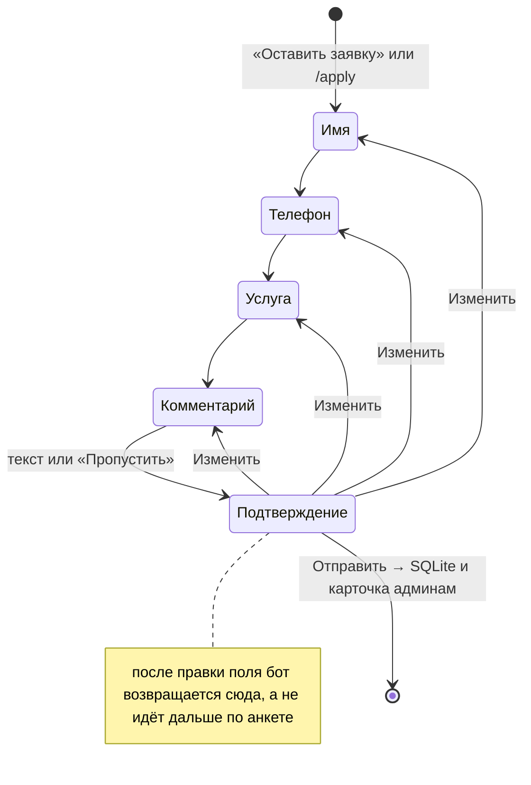

# Telegram-бот для заявок на aiogram 3

Бот собирает заявки через анкету из четырёх шагов, сохраняет их в SQLite и присылает карточку в админ-чаты. У администратора есть `/leads`, `/export` в CSV, `/stats` и `/broadcast`. В коде разобраны случаи, когда заявка могла бы задвоиться или потеряться: двойное «Отправить», ошибка записи в базу, недоступный админ-чат. Студию «Ромашка Digital» я выдумал, её услуги и цены в [`texts.py`](bot/texts.py) тоже.

Стек: Python 3.11+, aiogram 3 (long polling, FSM, CallbackData), SQLite через aiosqlite, pytest (139 тестов, сценарии идут через настоящий диспетчер aiogram на фейковом Telegram), ruff.

Кусок вывода [`scripts/demo_dialog.py`](scripts/demo_dialog.py). Скрипт гоняет настоящие хендлеры на том же фейковом Telegram, что и тесты, токен и интернет ему не нужны. Вывод сокращён, эмодзи убраны или заменены словами:

```text
Анна: 8 900 12
бот → Анна:
   Не получилось распознать номер
   Введите его в формате +7 900 123-45-67 или нажмите «Отправить мой номер».
Анна: 8 (900) 123-45-67
бот → Анна:
   Номер сохранён: +7 (900) 123-45-67
...
Анна нажимает [Отправить]
бот → Анна:
   Спасибо, Анна! Заявка №1 принята.
бот → Админ:
   Заявка №1 · 26.09.2026 16:38
   Анна
   +7 (900) 123-45-67
   Лендинг
   Лендинг для кофейни, запуск через 2 недели
   Telegram: Анна (@anna)
   Статус: Новая
   [В работе]  [Закрыта]  [Отклонена]
```



## Что внутри

Если с экрана подтверждения исправить одно поле, бот сразу возвращает к проверке заявки, а не ведёт по остатку анкеты. Порядок шагов задан одним словарём `NEXT_STEP` в [`handlers/form.py`](bot/handlers/form.py), состояния лежат в [`states.py`](bot/states.py). Каждый хендлер поля после сохранения зовёт `after_field`: если в данных анкеты стоит `editing=True` (его ставит `confirm_edit_field`), функция сразу ведёт на подтверждение, иначе берёт следующий шаг из `NEXT_STEP`.

Два быстрых нажатия «Отправить» дают одну заявку. Диспетчер собран с `SimpleEventIsolation` ([`app.py`](bot/app.py)), поэтому апдейты одного пользователя обрабатываются по очереди, а не параллельно. `confirm_submit` снимает состояние (`state.set_state(None)`) до записи в базу, и второе нажатие, дождавшись очереди, уже не проходит фильтр `LeadForm.confirm` и получает «Эта кнопка устарела». Если запись падает, я возвращаю состояние в `LeadForm.confirm` и пробрасываю исключение в глобальный обработчик: человек видит сообщение об ошибке, данные анкеты на месте, «Отправить» можно нажать снова.

Карточка админам уходит только после записи в базу. Каждый чат обрабатывается отдельно, с одной повторной попыткой после `TelegramRetryAfter` ([`notify.py`](bot/services/notify.py)). Если бота удалили из админ-группы, клиент всё равно получает подтверждение, а остальные админ-чаты получают карточку. Если не удалось ответить клиенту, карточка админам всё равно уходит. Оба случая проверяются в [`test_user_flow.py`](tests/test_user_flow.py).

Телефон приводит к E.164 функция `normalize_phone` из [`validators.py`](bot/validators.py), она чистая и aiogram не импортирует. Допустимы цифры, пробелы, скобки, точки, дефисы и «+» в начале. Если «+» нет, ведущая 8 в 11-значном номере меняется на 7, а к 10 цифрам, начинающимся на 3, 4, 7, 8 или 9, спереди дописывается 7, то есть такой номер считается российским или казахстанским. Дальше общие проверки: 10–15 цифр, первая не 0, номер на 7 ровно из 11 цифр. Из 24 случаев в [`test_validators.py`](tests/test_validators.py): `8 900 123 45 67` → `+79001234567`, `(495) 123-45-67` → `+74951234567`, `+44 20 7946 0958` → `+442079460958`, а `+7 900 123` и `8-900-CALL-NOW` не проходят. Присланный контакт идёт через ту же функцию, а контакт с чужим `user_id` (например, приложенный из записной книжки, а не кнопкой «Отправить мой номер») бот не принимает.

В callback_data кнопок статуса лежит типизированный `LeadStatusCb(lead_id, status)` из [`callbacks.py`](bot/callbacks.py), а `lead_status` в [`keyboards.py`](bot/keyboards.py) не рисует кнопку текущего статуса: в выводе выше у новой заявки нет кнопки «Новая». Карточка может уйти в группу менеджеров, где кнопки видят все, поэтому `IsAdmin` на этот callback я не вешал: хендлер сам сверяет `ADMIN_IDS`, а остальным показывает алерт «Недостаточно прав».

Рассылка копирует сообщение (`copy_message`, без пометки «Переслано») активным пользователям по одному, с паузой 0,05 с, то есть не больше 20 сообщений в секунду. Рядом с константой в [`broadcast.py`](bot/services/broadcast.py) комментарий, что Telegram разрешает около 30. На `TelegramRetryAfter` бот ждёт, сколько сказал Telegram, и делает одну повторную попытку. `TelegramForbiddenError` и `TelegramNotFound` помечают пользователя `is_blocked`, и в рассылки он не попадает, пока снова не придёт в бота (`/start`, новая заявка или разблокировка).

Сама рассылка идёт фоновой задачей: хендлер сразу освобождается, и админ может дальше пользоваться ботом. [`tasks.py`](bot/services/tasks.py) держит ссылки на задачи в `set`, иначе сборщик мусора может прервать задачу на середине. При остановке `on_shutdown` ждёт их до 15 секунд и отменяет то, что не успело; `stop_grace_period` в compose и `TimeoutStopSec` в unit стоят на 20 секундах. Прогресс рассылки нигде не записывается: если её прервать, повторный `/broadcast` уйдёт всем активным пользователям, в том числе тем, кто сообщение уже получил.

`/export` отдаёт CSV под Excel с русской локалью: UTF-8 с BOM, разделитель «;», переводы строк CRLF. `sanitize_cell` в [`export.py`](bot/export.py) ставит апостроф перед значением, которое начинается с `=`, `+`, `-`, `@`, табуляции или `\r`, так что комментарий `=HYPERLINK(...)` остаётся текстом. Через неё проходят имя из анкеты, комментарий и `tg_full_name`. Телефон через неё не идёт: после валидатора там только «+» и цифры. Username пишется без «@», потому что Excel считает «@…» началом формулы.

Если бот был выключен, нажатия кнопок копятся у Telegram и после запуска приходят протухшими: `answerCallbackQuery` на них отвечает «query is too old». `ack()` в [`handlers/utils.py`](bot/handlers/utils.py) ловит эту ошибку, пишет её в debug-лог и не прерывает хендлер, так что действие выполняется. Так срабатывают кнопки меню и статусов заявки: в `LeadStatusCb` уже лежат `lead_id` и статус, состояние FSM им не нужно. Кнопки внутри анкеты (услуга, «Отправить», «Изменить») после перезапуска отвечают «Эта кнопка устарела»: FSM хранится в `MemoryStorage`, и недозаполненная анкета теряется. Тест `test_expired_callback_query_still_works` подсовывает эту ошибку при нажатии «Отправить» в живой анкете и проверяет, что заявка сохранилась.

## Docker и systemd

С заполненным `.env` (см. «Запуск») `docker compose up -d --build` собирает образ из [`Dockerfile`](Dockerfile) и запускает бота от `botuser` с uid 10001, база лежит в томе `bot-data`. Логи пишет драйвер json-file с ротацией, 3 файла по 10 МБ ([`docker-compose.yml`](docker-compose.yml)). Если Docker Hub недоступен, базовый образ подменяется переменной `PYTHON_IMAGE`, пример с зеркалом есть в комментарии там же.

Для VPS без Docker есть unit [`deploy/romashka-bot.service`](deploy/romashka-bot.service). Он ждёт в `/opt/romashka-bot` содержимое этой папки (не весь клон `portfolio`), `.venv` с зависимостями из `requirements.txt`, заполненный `.env` и системного пользователя `botuser` как владельца; сам unit копируется в `/etc/systemd/system/`, дальше `systemctl daemon-reload` и `systemctl enable --now romashka-bot`. `Restart=on-failure` стоит вместе с `RestartPreventExitStatus=2`: если конфиг не проходит проверку при старте (нет `BOT_TOKEN` или у него неверный формат, ID не числами, неизвестный `TIMEZONE`, не открываются `DB_PATH` или `LOG_FILE`), `python -m bot` выходит с кодом 2, и systemd не перезапускает его по кругу. Код 2 проверяют три теста в [`test_package.py`](tests/test_package.py). Песочницу задают `NoNewPrivileges=true`, `ProtectSystem=strict`, `ProtectHome=true` и `PrivateTmp=true`, а из постоянных путей сервис может писать только в `/opt/romashka-bot/data` (`ReadWritePaths`).

## Запуск

```bash
git clone https://github.com/sinnercode228/portfolio.git
cd portfolio/telegram-bot-demo
python3 -m venv .venv && source .venv/bin/activate
pip install -r requirements.txt
python scripts/demo_dialog.py   # диалог на фейковом Telegram, без токена и интернета
cp .env.example .env            # вписать BOT_TOKEN от @BotFather
python -m bot
```

Все переменные с комментариями лежат в [`.env.example`](.env.example), обязательна только `BOT_TOKEN`. В `ADMIN_IDS` перечисляются те, кому доступны админ-команды и кнопки статусов (свой ID бот покажет по `/id`). `ADMIN_CHAT_IDS` задаёт чаты для карточек заявок, пустая переменная означает те же `ADMIN_IDS`. `DB_PATH`, `TIMEZONE`, `LEAD_COOLDOWN_MINUTES`, `LOG_LEVEL` и `LOG_FILE` можно не трогать, значения по умолчанию описаны там же.

## Тесты

```bash
pip install -r requirements-dev.txt
pytest
ruff check . && ruff format --check .
```

139 тестов, токен и сеть не нужны. Сценарии идут через настоящий диспетчер aiogram поверх [`FakeSession`](tests/fakes.py): она записывает каждый вызов Bot API и отвечает локально, а тест проверяет, какие сообщения и кнопки ушли и что легло в базу. Прогон занимает меньше 30 секунд, и почти всё это время уходит на пять тестов в [`test_package.py`](tests/test_package.py), которые запускают Python подпроцессом: импорт пакета, `python -m bot` без токена и с путями `DB_PATH` и `LOG_FILE`, которые нельзя открыть, и сам `demo_dialog.py`.
