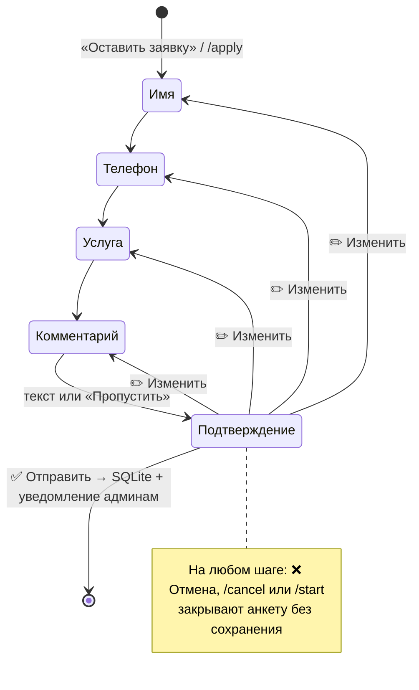

# Telegram-бот для сбора заявок · Lead collection bot

> **Демо-проект / Demo project.** Студия «Ромашка Digital» вымышлена. Код рабочий:
> замените тексты в `bot/texts.py` на свои, и бот готов для реального бизнеса.

[Русский](#русский) · [English](#english)

---

## Русский

Бот принимает заявки клиентов в Telegram, сохраняет их в SQLite и сразу присылает
менеджеру карточку заявки. У администратора есть выгрузка в CSV, статистика и рассылка.

### Возможности

**Для клиента**
- `/start`: приветствие и inline-меню «Услуги», «Цены», «Оставить заявку», «FAQ», «Контакты».
- Заявка в 4 шага: имя → телефон → услуга → комментарий → подтверждение.
  - Имя вводится текстом или одной кнопкой «Меня зовут …» (берётся из профиля Telegram).
  - Телефон можно ввести вручную в любом привычном формате (`8 (900) 123-45-67`, `+7 900…`,
    `(495) 123-45-67`, международные номера) или отправить кнопкой «📱 Отправить мой номер». Номер
    приводится к формату E.164. Чужой контакт бот не примет.
  - Услуга выбирается кнопкой, комментарий можно пропустить.
  - На экране подтверждения можно исправить любое поле и сразу вернуться к проверке.
- Отмена в любой момент: `/cancel`, кнопка «❌ Отмена» или слово «отмена».
- Защита от дублей: повторное нажатие «Отправить» не создаёт вторую заявку.
  Антиспам: пауза между заявками настраивается (`LEAD_COOLDOWN_MINUTES`).

**Для администратора**
- Мгновенное уведомление о заявке в один или несколько чатов (личка, группа менеджеров).
  Под карточкой кнопки статусов: 🟡 В работе · ✅ Закрыта · 🚫 Отклонена.
- `/leads`: последние 10 заявок.
- `/export`: все заявки в CSV (UTF-8 с BOM и разделителем `;`, открывается в Excel без настроек).
- `/stats`: пользователи, заявки за сегодня и 7 дней, конверсия, разбивка по услугам и статусам.
- `/broadcast`: рассылка любого сообщения (текст, фото, видео, документ) после предпросмотра
  и подтверждения. Учитывает лимиты Telegram. Пользователи, заблокировавшие бота,
  помечаются и больше не получают рассылки.
- `/id`: показывает ID пользователя и чата, нужен при настройке `.env`.

**Надёжность**
- Глобальный обработчик ошибок: ошибка пишется в лог, пользователь получает вежливое
  сообщение, данные анкеты сохраняются, и можно просто нажать «Отправить» ещё раз.
- Если админ-чат недоступен, заявка всё равно сохраняется, а клиент получает подтверждение.
  И наоборот: если не удалось ответить клиенту, менеджеры всё равно получают карточку заявки.
- Нажатия кнопок, накопившиеся, пока бот был выключен (обновление, перезапуск сервера),
  после запуска обрабатываются как обычно, без ошибок «query is too old».
- Весь пользовательский ввод экранируется в HTML-сообщениях, CSV защищён от formula injection.
- Понятные сообщения об ошибках конфигурации (токен, ID, часовой пояс, путь к базе и логам,
  версия Python) без трейсбеков. Токен никогда не пишется в лог.
- Апдейты одного пользователя обрабатываются строго по очереди (`SimpleEventIsolation`),
  поэтому быстрые двойные нажатия не ломают анкету.
- Рассылка идёт в фоне и не блокирует бота. При остановке ей даётся время завершиться.
- Корректная остановка по SIGINT/SIGTERM (Docker, systemd).

### Как выглядит диалог

Сценарий можно посмотреть без токена и без интернета (нужны только установленные
зависимости, см. «Быстрый старт», шаг 2):

```bash
python scripts/demo_dialog.py
```

Фрагмент вывода:

```text
👤 Анна: 8 (900) 123-45-67
🤖 → Анна:
   📱 Номер сохранён: +7 (900) 123-45-67
🤖 → Анна:
   📝 Заявка · шаг 3 из 4
   Какая услуга вас интересует?
   [Лендинг]  [Интернет-магазин]
   [Telegram-бот]  [Поддержка сайта]
   [Другое / не знаю]
   [❌ Отмена]
...
👤 Анна нажимает [✅ Отправить]
🤖 → Анна:
   ✅ Спасибо, Анна! Заявка №1 принята.
🤖 → Админ:
   🔔 Заявка №1 · 24.09.2026 17:47
   👤 Анна
   📱 +7 (900) 123-45-67
   🛠 Лендинг
   💬 Лендинг для кофейни, запуск через 2 недели
   Telegram: Анна (@anna)
   Статус: 🆕 Новая
   [🟡 В работе]  [✅ Закрыта]  [🚫 Отклонена]
```

Схема анкеты:



### Стек

Python 3.11+ (проверено на 3.14) · [aiogram 3](https://docs.aiogram.dev/) (FSM, роутеры,
CallbackData) · SQLite через aiosqlite · python-dotenv · pytest + pytest-asyncio · ruff ·
Docker / systemd.

### Структура проекта

```text
bot/
├── __main__.py        # python -m bot
├── main.py            # запуск: конфиг → логи → БД → polling
├── app.py             # сборка Bot и Dispatcher, меню команд
├── config.py          # настройки из .env с понятными ошибками
├── texts.py           # ВСЕ тексты, услуги, цены, FAQ, контакты
├── formatting.py      # сборка сообщений из текстов (с HTML-экранированием)
├── validators.py      # проверка имени, телефона, комментария
├── db.py              # слой SQLite: заявки, пользователи, статистика
├── export.py          # выгрузка в CSV
├── keyboards.py       # клавиатуры
├── callbacks.py       # типизированные callback_data
├── states.py          # состояния FSM
├── filters.py         # фильтр IsAdmin
├── services/
│   ├── notify.py      # уведомления админам
│   ├── broadcast.py   # рассылка
│   └── tasks.py       # фоновые задачи
└── handlers/          # common, form, menu, admin, errors, fallback
tests/                 # 139 тестов, включая сквозные сценарии на фейковом Telegram
scripts/demo_dialog.py # демонстрация диалога в терминале
deploy/romashka-bot.service  # unit-файл systemd
Dockerfile, docker-compose.yml, Makefile, .env.example
```

### Быстрый старт

**1. Создайте бота в @BotFather**

1. Откройте [@BotFather](https://t.me/BotFather) и отправьте `/newbot`.
2. Задайте имя (например, «Ромашка Заявки») и username, который заканчивается на `bot`.
3. Скопируйте токен вида `123456789:AAE…`: это `BOT_TOKEN`.
4. По желанию задайте описание и аватар: `/setdescription`, `/setuserpic`.

**2. Установите и запустите**

```bash
git clone https://github.com/sinnercode228/telegram-bot-demo.git
cd telegram-bot-demo
python3 -m venv .venv
source .venv/bin/activate          # Windows: .venv\Scripts\activate
pip install -r requirements.txt
cp .env.example .env               # впишите BOT_TOKEN
python -m bot
```

**3. Назначьте себя администратором**

1. Напишите боту `/id` и скопируйте свой Telegram ID.
2. Впишите его в `.env`: `ADMIN_IDS=123456789` (несколько ID через запятую).
3. Перезапустите бота и отправьте ему `/start`. После этого появятся админ-команды в меню.

**4. (Необязательно) Уведомления в группу менеджеров**

1. Добавьте бота в группу.
2. Отправьте в группе `/id@имя_вашего_бота` и скопируйте ID чата (начинается с `-100`).
3. Укажите `ADMIN_CHAT_IDS=-100…` (можно вместе с личными ID: `-100…,123456789`).

Менять статус заявки из группы могут только пользователи из `ADMIN_IDS`.

### Настройки `.env`

| Переменная | Обязательна | По умолчанию | Описание |
|---|---|---|---|
| `BOT_TOKEN` | да | — | Токен от @BotFather |
| `ADMIN_IDS` | желательно | — | ID администраторов через запятую |
| `ADMIN_CHAT_IDS` | нет | = `ADMIN_IDS` | Куда слать уведомления о заявках |
| `DB_PATH` | нет | `data/leads.db` | Файл базы SQLite |
| `TIMEZONE` | нет | `Europe/Moscow` | Часовой пояс для дат |
| `LEAD_COOLDOWN_MINUTES` | нет | `5` | Пауза между заявками одного пользователя, `0` без паузы |
| `LOG_LEVEL` | нет | `INFO` | `DEBUG` / `INFO` / `WARNING` / `ERROR` |
| `LOG_FILE` | нет | — | Путь к файлу логов с ротацией |

### Запуск в Docker

```bash
cp .env.example .env               # впишите BOT_TOKEN и ADMIN_IDS
docker compose up -d --build
docker compose logs -f bot         # логи
docker compose down                # остановить
```

Если Docker Hub недоступен (ошибка при скачивании `python:3.14-slim`), соберите образ
из зеркала Google, остальное без изменений:

```bash
PYTHON_IMAGE=mirror.gcr.io/library/python:3.14-slim docker compose up -d --build
```

База хранится в томе `bot-data` и переживает пересборку образа. Резервная копия:

```bash
docker compose cp bot:/app/data/leads.db ./leads-backup.db
```

### Деплой на VPS (systemd)

Подходит для Ubuntu 24.04 / Debian 12 и новее (нужен Python 3.11+). На старых системах
используйте Docker.

```bash
# 1. Системный пользователь и код
sudo apt update && sudo apt install -y python3 python3-venv git
sudo useradd --system --no-create-home --shell /usr/sbin/nologin botuser
sudo git clone https://github.com/sinnercode228/telegram-bot-demo.git /opt/romashka-bot
sudo chown -R botuser:botuser /opt/romashka-bot
cd /opt/romashka-bot

# 2. Окружение и зависимости
sudo -u botuser python3 -m venv .venv
sudo -u botuser .venv/bin/pip install --no-cache-dir -r requirements.txt

# 3. Настройки
sudo -u botuser cp .env.example .env
sudo -u botuser nano .env          # BOT_TOKEN, ADMIN_IDS
sudo chmod 600 .env

# 4. Сервис
sudo cp deploy/romashka-bot.service /etc/systemd/system/
sudo systemctl daemon-reload
sudo systemctl enable --now romashka-bot
sudo systemctl status romashka-bot
sudo journalctl -u romashka-bot -f # логи
```

Сервис перезапускается при сбоях, но не при ошибке конфигурации (код выхода 2), чтобы не
крутиться в цикле. Бот работает в песочнице systemd и может писать только в `data/`.

Обновление:

```bash
cd /opt/romashka-bot
sudo -u botuser git pull
sudo -u botuser .venv/bin/pip install --no-cache-dir -r requirements.txt
sudo systemctl restart romashka-bot
```

### Тесты и качество кода

```bash
pip install -r requirements-dev.txt
pytest                             # 139 тестов, около 8 секунд
ruff check . && ruff format --check .
```

Тесты не требуют токена и сети. Бизнес-логика (валидация, БД, CSV, тексты) покрыта
unit-тестами. Сценарии (анкета, правка, отмена, ошибки БД, рассылка, статусы, права
доступа) прогоняются через настоящие хендлеры aiogram на фейковой сессии Telegram
(`tests/fakes.py`), которая записывает каждый запрос бота.

Короткие команды: `make install`, `make check`, `make run`, `make docker-up` (`make help`
выводит список).

### Как адаптировать под свой бизнес

- **Тексты, услуги, цены, FAQ, контакты** правятся в `bot/texts.py`, трогать код не нужно.
- **Шаги анкеты**: `bot/handlers/form.py` (порядок задаётся в `NEXT_STEP`).
- **Интеграции** (Google Таблицы, amoCRM, Bitrix24, e-mail): добавляются рядом с
  `services/notify.py`, заявка к этому моменту уже сохранена.
- **Масштабирование**: `MemoryStorage` → `RedisStorage` (анкета переживёт перезапуск),
  polling → webhook, SQLite → PostgreSQL. Слой БД изолирован в `db.py`.

---

## English

A Telegram bot that collects customer leads, stores them in SQLite and instantly notifies
managers. Admins get CSV export, stats and broadcasts. The studio "Ромашка Digital"
is fictional. This is a portfolio demo with production-ready code.

### Features

- **Client side:** `/start` with an inline menu (Services, Prices, Apply, FAQ, Contacts),
  and a 4-step FSM form: name → phone → service → comment → confirm.
  The phone can be typed in any common format or shared with one button, and is
  normalized to E.164. Other people's contacts are rejected. Any field can be edited
  from the confirmation screen. Cancel works at any step. Double-submit protection
  and an anti-spam cooldown are built in.
- **Admin side:** instant lead cards in one or more chats (DM or a managers' group)
  with status buttons. `/leads` (last 10), `/export` (Excel-friendly CSV), `/stats`,
  `/broadcast` with preview and confirmation (rate-limited, tracks users who blocked the bot),
  and `/id` for setup.
- **Robustness:** a global error handler, lead persistence even if notifications fail,
  manager notification even if the reply to the client fails, safe handling of button presses
  queued while the bot was offline,
  HTML escaping of all user input, CSV formula-injection protection, readable config
  errors, per-user update serialization (`SimpleEventIsolation`), background broadcasts,
  and graceful shutdown on SIGTERM.

### Quick start

1. Create a bot with [@BotFather](https://t.me/BotFather) (`/newbot`) and copy the token.
2. Install and run:
   ```bash
   git clone https://github.com/sinnercode228/telegram-bot-demo.git
   cd telegram-bot-demo
   python3 -m venv .venv && source .venv/bin/activate
   pip install -r requirements.txt
   cp .env.example .env    # set BOT_TOKEN
   python -m bot
   ```
3. Send `/id` to your bot, put the ID into `ADMIN_IDS` in `.env`, and restart.
4. Optional: add the bot to a group, send `/id@your_bot` there, and put the group ID
   (`-100…`) into `ADMIN_CHAT_IDS`.

All settings are listed in `.env.example` and in the table above.

### Docker

```bash
cp .env.example .env
docker compose up -d --build
docker compose logs -f bot
```

If Docker Hub is unreachable, build from Google's mirror:
`PYTHON_IMAGE=mirror.gcr.io/library/python:3.14-slim docker compose up -d --build`.

Data lives in the `bot-data` volume. Back it up with
`docker compose cp bot:/app/data/leads.db ./leads-backup.db`.

### VPS with systemd

Follow the commands in [Деплой на VPS (systemd)](#деплой-на-vps-systemd) above:
create a system user, clone into `/opt/romashka-bot`, create a venv, fill `.env`,
copy `deploy/romashka-bot.service` to `/etc/systemd/system/`, then run
`systemctl enable --now romashka-bot`. Logs are available via `journalctl -u romashka-bot -f`.

### Tests

```bash
pip install -r requirements-dev.txt
pytest            # 139 tests, no token or network needed
python scripts/demo_dialog.py   # watch a full conversation in the terminal
```

End-to-end scenarios run through the real aiogram handlers on a fake Telegram session
(`tests/fakes.py`) that records every API call the bot makes.

### Customization

Edit `bot/texts.py` for the brand, services, prices, FAQ and all bot messages. Form
steps are in `bot/handlers/form.py`. Add CRM, Google Sheets or e-mail integrations
next to `bot/services/notify.py`.

---

License: MIT.
